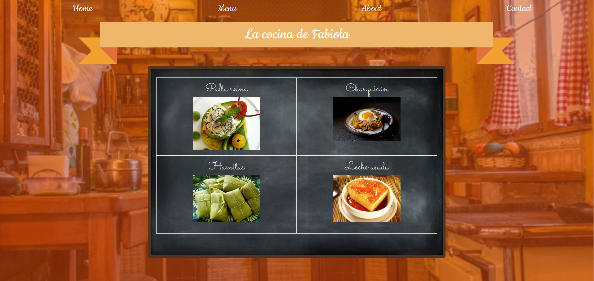

# My mom's kitchen

> I had to build a single-page application for a hypothetical restaurant for learning purposes, and I decided to use it to showcase my favorite dishes made by my mother.

## Built With

- HTML5
- CSS3
- JavaScript
- Webpack 

## Live Demo

[Live Demo Link](https://aliciapaz.github.io/my-moms-kitchen/)

## Getting Started

To get a local copy up and running follow these simple example steps.

### Setup and Install

- Clone this repository using the link above (click on the 'code' button)
- Open a terminal and `cd` to the cloned repository
- Run `npm install`
- Run `npm run build`
- Open `dist/index.html` in a live server in your preferred browser to explore the different sections! 

### Usage

- Click on the tabs on the menu to check out the content in each section!

### Deployment

- Deployed on GitHub Pages

## Authors

👤 **Alicia Rojas**

- GitHub: [@aliciapaz](https://github.com/aliciapaz)
- Twitter: [@_alicia_paz](https://twitter.com/_alicia_paz)
- LinkedIn: [Alicia Rojas](https://www.linkedin.com/in/aliciapazrojas/)

## 🤝 Contributing

Contributions, issues, and feature requests are welcome!

Feel free to check the [issues page](https://github.com/aliciapaz/my-moms-kitchen/issues).

## Show your support

Give a ⭐️ if you like this project!

## Acknowledgments

- [The Odin Project](https://www.theodinproject.com/paths/full-stack-javascript/courses/javascript/lessons/restaurant-page)

## 📝 License

This project is [MIT](LICENSE) licensed.
